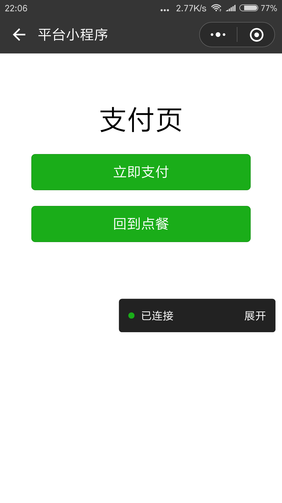

## 前提说明

以下调研都在 关闭安全域名/安卓机/远程调试/绕过小程序授权情况下
ios 真机测试有不可解决的bug
https://developers.weixin.qq.com/blogdetail?action=get_post_info&lang=zh_CN&token=&docid=0002a07de84db0b625469597a56c00

------

## 安全域名

### 规则: 
* 安全域名限制 最多20条, 每年50次修改
* 顶级域名配置安全域名限制, 二级域名不能起效果
* 页面iframe不支持引用非业务域名, 也需要配置到域名白名单
* 不可以进入非安全域名下的页面和服务, 如: html
* 资源类的地址, 接口不属于安全域名限制, 如: https://jscdn.2dfire.com

### 现有的安全域名统计
* https://2dfire.com
* https://d.2dfire.com
* https://cdn.2dfire.com  (页面中有个js创建的iframe)
* https://d.2dfire-pre.com
* https://api.l.whereask.com
* https://weidian.2dfire.com/  (短码未授权会跳转)

### 影响范围:
不可以进入非安全域名下的页面和服务
* 内部域名: 统计、cdn、商品图片、活动
* 二次授权: 5i权金城等等
* 第三方合作: 广告,活动等

### 解决方式: 
* 配置安全域名(有限名额)
* nginx 代理 `https://api.l.whereask.com/cdn/` => `https://cdn.2dfire.com/`

------

## jssdk调研
情况: 
* 在微信开发者工具/真机调试中, 可以使用jssdk, 版本(http://res.wx.qq.com/open/js/jweixin-1.0.0.js)
* 与小程序交互的api, 需要jweixin-1.3.2 (https://res.wx.qq.com/open/js/jweixin-1.3.2.js)
* 一小段时间出现 the permissions value is offline verifying
* jweixin-1.0.0 升级到 jweixin-1.3.2 后, 在微信中各个功能都能调用, 暂无问题, 详见下面

jweixin-1.0.0 使用到的微信接口, 及使用情况: 
- [x] getLocation
- [-] onMenuShareTimeline         // 不支持也不需要 
- [-] onMenuShareAppMessage       // 不支持也不需要
- [x] scanQRCode
- [-] hideMenuItems               // 不支持也不需要, permission denied
- [-] showMenuItems               // 不支持也不需要, permission denied
- [x] getNetworkType

jweixin-1.3.2 接口调研
- [x] wx.miniProgram.navigateTo   // 保留当前页面，跳转到应用内的某个页面，使用wx.navigateBack可以返回到原页面 
- [x] wx.miniProgram.navigateBack // 关闭当前页面，返回上一页面或多级页面
- [x] wx.miniProgram.redirectTo   // 关闭当前页面，跳转到应用内的某个页面
- [x] wx.miniProgram.reLaunch     // 关闭所有页面，打开到应用内的某个页面
- [x] wx.miniProgram.switchTab    // 跳转到 tabBar 页面，并关闭其他所有非 tabBar 页面
- [x] wx.miniProgram.getEnv       // 获取当前环境

------

## 小程序与webview交互
* 小程序在`web-view`页面,退出再进入小程序, 会保留当前状态
* **从A页面(内嵌H5), navigateTo B, 再navigateBack A, 会保留A页面的`<web-view>`状态**
* 小程序 通知 webview: 执行改hash, 监听url变化
* 小程序 通知 webview: jsBridge, url执行, 待验证

以下细节
* wx.navigateTo, 保留当前页面，跳转到应用内的某个页面, 会保留当前页面的`<web-view>`状态
* wx.navigateBack, 关闭当前页面，返回上一页面或多级页面, 会保留上个页面的`<web-view>`状态
* wx.switchTab, 跳转到 tabBar 页面， 会保留`<web-view>`状态, 但底部有tabBar
* 在h5使用 wx.minprogram.switchTab,可以跳到小程序, 并保留`<web-view>`状态
* 在小程序中使用 wx.switchTab,可以跳回h5页面, 并保留`<web-view>`状态

## 返回键
* 在安卓中, 点击返回就退出当前小程序, 在ios中有其它表现形式
* 只有页面路径大于2, 小程序左上角才有返回键, `<web-view></web-view>` 占一层, 所以首页是`<web-view>`不会有返回键
* A首页 wx.navigateTo( ) B`<web-view>`, **B有返回键**, A页面保留, B页面路径为2;
* A首页 wx.redirectTo( ) B`<web-view>`, **B没有返回键**, A页面被关闭, B页面路径为1
* A首页 wx.reLaunch( ) B`<web-view>`, **B没有返回键**, 所有页面被关闭, B页面路径为1

以下案例
A`<web-view>`进行到账单页, 点立即支付, 支付参数通过url navigateTo B小程序支付页, 
* 在B小程序支付页, 唤起支付成功 wx.reLaunch 到 C支付完成页, 不会有返回键
* 在B小程序支付页, 唤起支付失败 wx.navigateBack 到 A, 不会有返回键, 会保留A页面的`<web-view>`状态

从A首页 redirectTo B<\web-view\>

 

从A<\web-view\> navigateTo B, navigateBack A<\web-view\>

------

## 点餐流程问题
* 需要手动增加返回, 页面会出现死胡同情况
* 可能需要增加刷新按钮, 在弱网/js报错等情况下, 页面出错/空白等情况
* 内嵌网页若有微信支付功不能直接支付
* https 访问 http接口, 导致一些功能不能使用 (线上全是https, 不会有这情况)
* 火通卡, 附近的店, 需要授权 
* H5需要授权, 小程序给token, 塞入内嵌H5 url中
<!-- * 必出现授权失败: MULTI_OAU061, 授权接口失败 -->
* 微信开发者工具调试不了`<web-view>`中的信息, 包括element, console, network; 可以使用h5页面中引入vConsole.js等工具
* 动态修改title (暂时没问题)

### 解决方式
* 使用小程序支付, 通过url传递支付参数给小程序支付页唤起支付

-----

参考: 

<a href="https://www.jianshu.com/p/aa29852ab695">微信小程序开发之webview组件内网页实现微信原生支付</a>
<a href="https://mp.weixin.qq.com/debug/wxadoc/dev/component/web-view.html">小程序web-view</a>

------

### 错误图例

选择地址无法返回
https访问http接口

<!--
### 反向代理
* 解决二级域名过多, https://api.l.whereask.com/cdn => https://cdn.2dfire.com
* 解决不受控的域名, https://api.l.whereask.com/hm => https://hm.baidu.com/hm.gif
* 解决https访问http资源, https://api.l.whereask.com/api => http://api.l.whereask.com/api
-->

