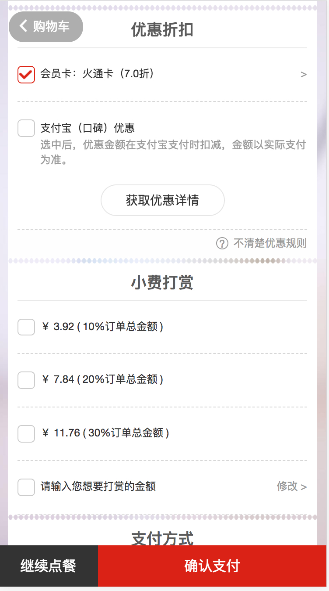
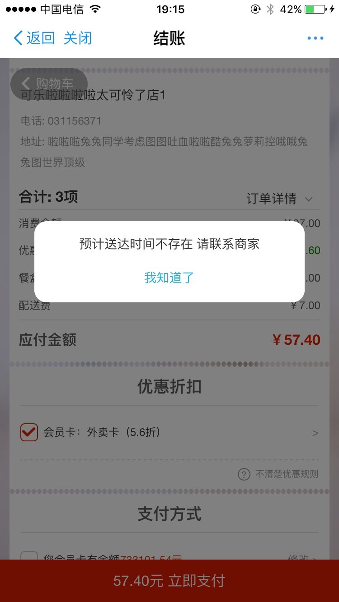
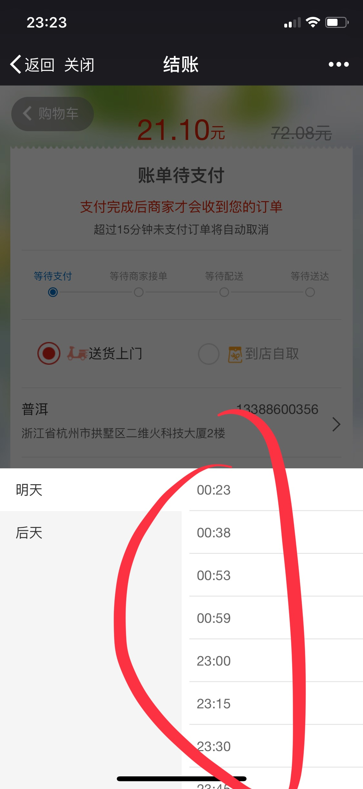
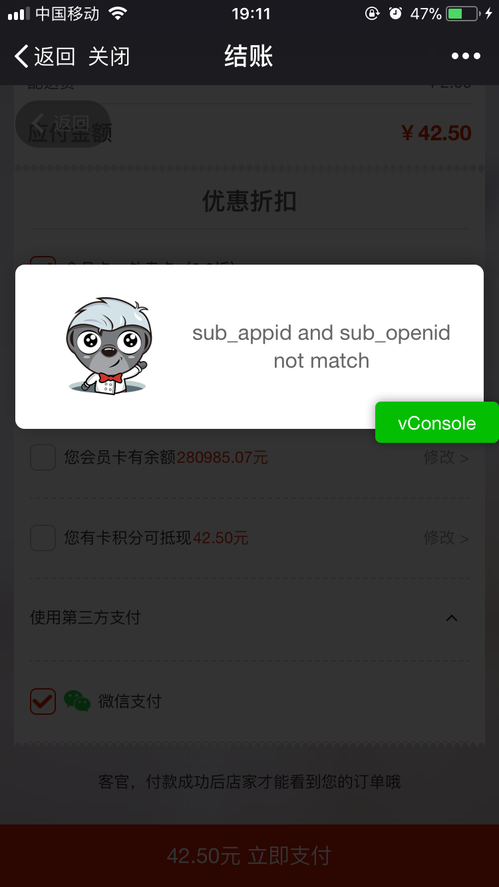

## 分享 | 结账页快速定位解决问题方针 (甩锅大指南)

### 目标
我们的目的是及时定位问题(甩锅), 解决问题
不要占据我们太多debugger时间

结账页开发量不大，但联调耗时巨大，一个接口从 **weixin-meal** 到 **trade-center** => **trade-platform** 再到外卖中心/收银机/掌柜端
花费在协助服务端解决问题上时间异常的多

如果不hold住, 那么一天的时间都在找bug了
找bug3小时, 解决一行代码
我曾经就是这样, 感觉到绝望, bug指给我, 半天缺找不到解决办法

<!-- 如果一个问题, 每个人都去找一遍, 花费的时间与收益不成比例 -->

### 涉及到的流程
* 正常流程
* 预付款流程
* 后付款流程
* 帮人买单流程
* 聚合支付
* 预购流程
* 外卖流程
  * 企业外卖
  * 零售流程
  * 高铁流程

### 需要对接的人员/部门
* 交易中心: 拉取账单/下单/算价  @生抽 @荆芥 @肠粉
* 外卖中心: 配送时间/配送费  @啤酒 @小青鱼  
* 授权中心: 授权 @排骨/茄子
* 优惠平台: 优惠相关 @胡柚
* 收银机/掌柜端: 预约状态/时间 @六道木

### 接口错误
* 502, @wexin-meal
* 404, 调用api url 不正确
* 外卖账单异常, 交易中心/weixin-meal
* 迟迟不反回结果, 交易中心/weixin-meal在断点调试
* sub_appid, appid openId 不匹配
* ERR_101550, 接口挂了 trade-platform/wexin-meal/trade-center; 也可能在发布中

### 页面异常对应api
* 小费不显示: response.data.tipFeeRuleParam @交易中心
* 口碑优惠不显示 @交易中心
    1. 在支付宝中 
    2. response.fee.koubeiFee > 0
* 配送时间 @外卖中心
    * 暂无可选数据: 配送时间有问题 
    * 暂无数据: 下单了且下单前用户没选择时间 
    * 配送时间数据不对
* 显示发票 @外卖中心
    1. 选中地址为企业地址
    2. 商家支持发票 
    3. 需要支付金额大于0
* 是否支持配送方式选择 @交易中心
    * 到店自取 送货上门    
    * shopParam.pickupFlag
    * shopParam.cashVersion
* 默认地址逻辑: @交易中心
    1. 有企业id
    2. 经纬度
* 支付页面未注册: @妙脆角/茄子/飞鱼籽
    * 看下dev_193有没有被占用 
    * 配置一下dev_193 转发到项目环境 
    * http://ngrok.2dfire-daily.com:8990/nginx-atom/page/home.html#/main?cat=H5
    * 小二服务端(茄子)配置转发到dev_193
* 算价出错 @交易中心
* 优惠方式/支付方式 @交易中心
    * 优惠没选中/优惠禁用/优惠列表
    * 卡支付专享
* 预约状态: 
    * 现在都是预约外卖, 前端判断不了预约不预约  reserve_status === 1 
    * 现在任何流程都没有立即送达概念
    * 打印有问题找@收银, @交易中心

### notice
* 账单页调试
* 线上店不能预发环境使用，预发环境不能线上环境使用
* 各种高清无码

### other

  <!-- 

    

      
      
基础模块

    

  
 -->
  

    

      
      
预计送达时间不存在

    

    

      
      
配送时间段不正确

    

    

      
      
appid与openid不正确

    

  

